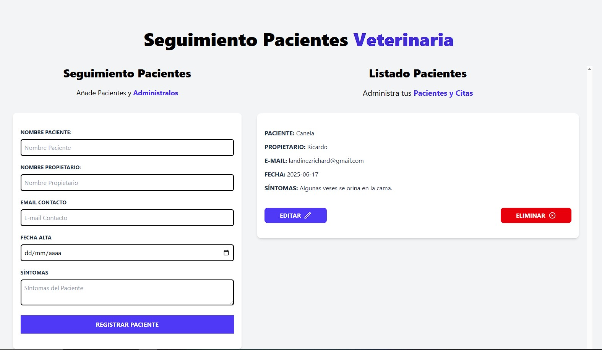

# Administrador Citas Veterinarias:

Simulador de un administrador de citas para pacientes de veterinaria, hecho en vainilla JavaScript usando clases(POO).

- Maneja clases para "Notificacion" y "AdminCitas"..
- Validación de todos los campos requeridos.
- Permite edición de los datos ingresados en el mismo formulario.
- Se puede eliminar los datos de un paciente, previa confirmación en un modal.
- Alertas o notificaciones de validación y demás acciones.
- Usa Tailwind para los estilos.

## Screenshots

